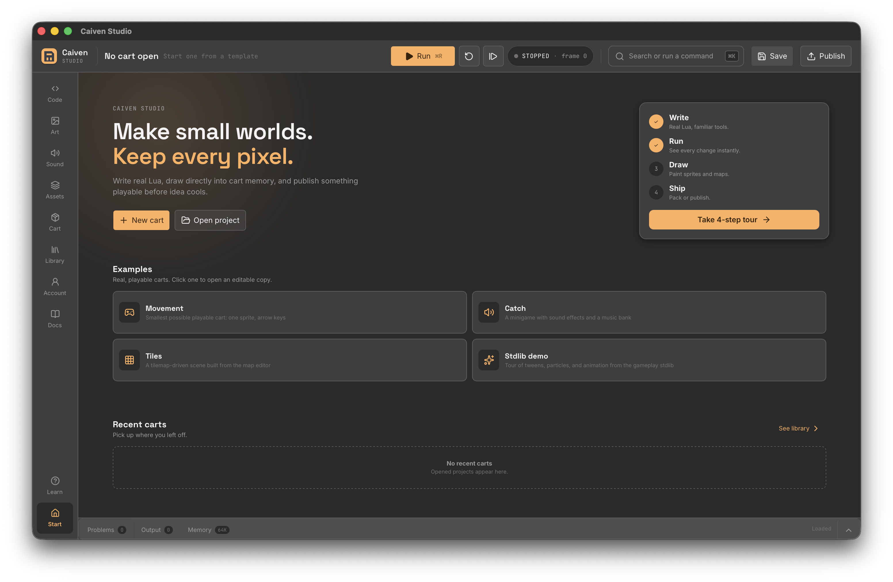

# 🎮 Caiven


[](https://github.com/andrejmarkus/caiven/actions/workflows/rust.yml)
[](https://github.com/andrejmarkus/caiven/releases?q=studio-v)
[](https://github.com/andrejmarkus/caiven/releases?q=machine-v)

**Play a tiny game. Change one thing. Make it yours.**

**Caiven** is a retro-inspired fantasy console written in Rust. Every cart is real Lua 5.4 you can open and change: in the browser on Caiven Port (play → remix → publish, no install), or in the full desktop editor, Caiven Studio.



## 🚀 Quick Start

Grab whichever matches what you want to do — Studio and Machine release
independently, so check both:

- **Remix in the browser** — on a Caiven Port, open a cart, press **Remix this**, change a number, see it run, publish your version. No install. Run your own Port: [docs/port.md](docs/port.md).
- **[Caiven Studio](https://github.com/andrejmarkus/caiven/releases?q=studio-v)** — the editor, to _make_ a game (code, sprites, sound, map). Windows/macOS/Linux installers.
- **[Caiven Machine](https://github.com/andrejmarkus/caiven/releases?q=machine-v)** — the standalone player, to just _run_ a `.cav` cart someone shared with you. No editor.

Install like any normal app and launch **Caiven Studio**, or unpack **Caiven Machine** and run:

```bash
./caiven-machine my-game/    # project dir, Ctrl+R restarts the cart
./caiven-machine game.cav    # distribution cartridge
```

> **First launch warning?** Release builds aren't notarized/signed yet — your
> OS will flag the app as untrusted the first time. macOS: right-click the
> app → **Open** → **Open** again (or `xattr -dr com.apple.quarantine
> /Applications/Caiven\ Studio.app`). Windows: **More info** → **Run
> anyway**. See [code signing status](docs/releasing.md#code-signing-status)
> for details.

Building from source, the Cargo workspace, and Studio/Machine CLI reference
are in [docs/building.md](docs/building.md).

## 🐣 A taste of Caiven Lua

```lua
function _init()
  set_palette_color(0, 10, 10, 30)  -- dark blue background
end

function _update()
  clear_screen()
  if button_down(3) then x = (x or 60) + 2 end  -- right
  sprite(0, x or 60, 60)
end
```

`_init()` runs once, `_update()` runs every frame, optional `_draw()` runs right after it. Full walkthrough: [docs/tutorial.md](docs/tutorial.md). Full builtin list: [docs/api-reference.md](docs/api-reference.md).

## ✨ Features

- 🌙 **Real Lua 5.4** — embedded via `mlua` (vendored, no system Lua required)
- 🎨 **Palette-based Graphics** — 192×128 resolution (24×16 tiles), 16-color palette built as 4 hue ramps × 3 shades plus black, white and 2 accents, swappable at runtime; sprites, 192×128 tilemap, shape primitives, camera
- 🔊 **Audio Engine** — 6 voices: 4 typed music channels (pulse, pulse, triangle, noise) plus 2 reserved for sound effects, so an sfx never cuts the melody
- 🧰 **Gameplay Stdlib** — tweens, easing, AABB/tile collision, particles, sprite-frame animation — pure Lua, preloaded into every cart
- 🖌️ **Caiven Studio** — Tauri 2 + Svelte 5 editor: live console, code and asset workspaces, diagnostics, command palette, publishing flow
- 🔍 **Debugger** — line breakpoints, pause/step-by-frame, script-globals inspector, live RAM view
- 🌐 **Caiven Port** — self-hostable cart sharing server: accounts, versioning, ratings & comments, browser Play

> [!NOTE]
> Caiven is creator-friendly: you own the games and assets you create, may sell them without royalties or a commercial-use fee, and do not have to publish your game source. See [Creator rights](CREATOR_RIGHTS.md).

## 📚 Documentation

- [Design Charter](docs/product/design-charter.md) — what Caiven is, the frozen hardware, and the gate every API must pass
- [Building from Source](docs/building.md) — prerequisites, install, CLI, project structure
- [Tutorial: Your First Game](docs/tutorial.md)
- [Built-in API Reference](docs/api-reference.md) — graphics, input, audio, stdlib, memory map
- [Caiven Studio](docs/studio.md) — workspaces, keybindings, build
- [Caiven Port](docs/port.md) — sharing server, REST API, Web Play
- [Key Bindings (Game)](docs/controls.md) — defaults and `controls.toml` overrides
- [Publishing a Release](docs/releasing.md)
- [Contributing](CONTRIBUTING.md) — development checks and review expectations
- [Security](SECURITY.md) — reporting and dependency exceptions
- [Port operations](docs/development/port-operations.md) — probes, deployment, backup and recovery
- [Handheld builds](docs/development/handheld-builds.md) — Miyoo, TrimUI, Anbernic

Full index: [docs/README.md](docs/README.md).

## 📜 License and creator policy

Caiven's source code is licensed under the [Mozilla Public License 2.0](LICENSE). Modifications to MPL-covered source files that are distributed must remain available under MPL-2.0, while separate files and larger works may use other terms as permitted by the licence.

Games and cartridges made with Caiven remain the creator's property. They may be sold without royalties, revenue share, a separate commercial-use licence, or a requirement to publish game source. See [Creator rights](CREATOR_RIGHTS.md).

The software licence does not grant rights to present unofficial forks as official Caiven releases. Normal descriptive use, community projects, and clearly identified forks are welcome under the [trademark policy](TRADEMARKS.md).

---

<p align="center">Made with ❤️ and 🦀 by Andrej Markuš</p>
