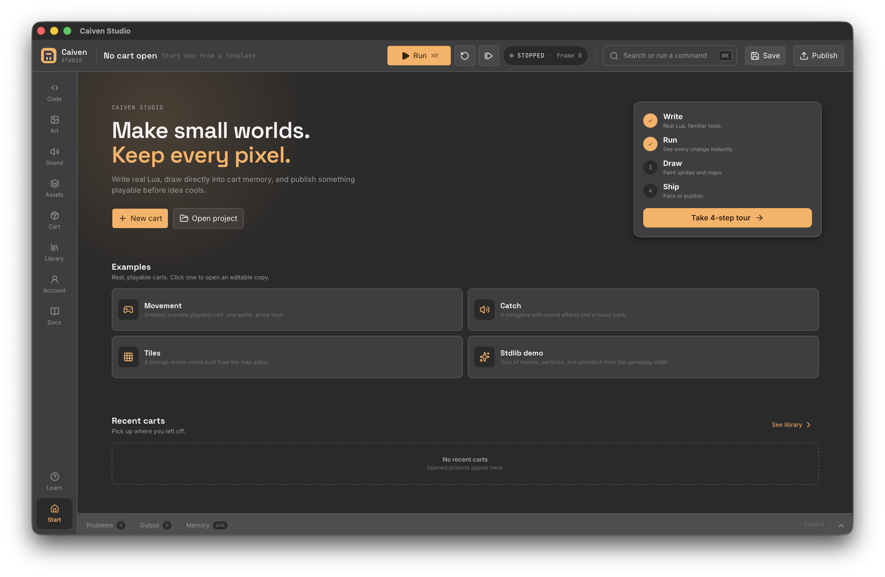

# Caiven


[](https://github.com/andrejmarkus/caiven/actions/workflows/rust.yml)
[](https://github.com/andrejmarkus/caiven/releases?q=studio-v)
[](https://github.com/andrejmarkus/caiven/releases?q=machine-v)

Caiven is a small fantasy console written in Rust. Games run on Lua at
192×128 pixels with a 16-color palette. You can open the source of any cart
and change it, either in the browser on a Caiven Port server or in the
desktop editor, Caiven Studio.



## Getting started

Studio and Machine have separate release tags, so check both lists.

- **Browser.** Open a cart on a Caiven Port, press _Remix this_, edit the
  code and publish your copy. To host your own Port, see
  [docs/port.md](docs/port.md).
- **[Caiven Studio](https://github.com/andrejmarkus/caiven/releases?q=studio-v)**
  is the editor for code, sprites, sound and maps. Installers exist for
  Windows, macOS and Linux.
- **[Caiven Machine](https://github.com/andrejmarkus/caiven/releases?q=machine-v)**
  plays `.cav` carts and has no editor.

Machine takes a project folder or a cart file:

```bash
./caiven-machine my-game/    # project folder; Ctrl+R restarts the cart
./caiven-machine game.cav    # packed cart
```

Release builds are not signed yet, so your OS will warn on first launch. On
macOS, right-click the app and choose Open twice, or run
`xattr -dr com.apple.quarantine /Applications/Caiven\ Studio.app`. On
Windows, click More info, then Run anyway. Details are in
[docs/releasing.md](docs/releasing.md#code-signing-status).

To build from source, see [docs/building.md](docs/building.md).

## A short example

```lua
function _init()
  set_palette_color(0, 10, 10, 30)  -- dark blue background
end

function _update()
  clear_screen()
  if button_down(3) then x = (x or 60) + 2 end  -- right
  sprite(0, x or 60, 60)
end
```

The console calls `_init()` once at start and `_update()` 60 times a second. If
you define `_draw()`, it runs after each update. The
[tutorial](docs/tutorial.md) builds a small game step by step, and the
[API reference](docs/api-reference.md) lists every builtin.

## What's in the box

- Lua 5.4 through `mlua`, vendored, so you don't need Lua installed.
- A 192×128 screen (24×16 tiles of 8×8 pixels) and a 16-color palette you
  can change at runtime. Sprites, a tilemap, shape drawing and a camera.
- Six audio voices: two pulse, one triangle and one noise channel for music,
  plus two channels reserved for sound effects so a jump sound doesn't cut
  the melody.
- A Lua standard library loaded into each cart with tweens, easing,
  collision checks, particles and sprite animation, written in plain Lua.
- Caiven Studio, built on Tauri 2 and Svelte 5, with a live console,
  code and asset editors, a debugger (breakpoints, frame stepping, globals
  and RAM views) and a publish flow.
- Caiven Port, a cart sharing server you can host yourself. It handles
  accounts, versions, ratings, comments and in-browser play.

## Documentation

- [Design charter](docs/product/design-charter.md): the fixed hardware specs
  and the rules for adding APIs
- [Building from source](docs/building.md)
- [Tutorial](docs/tutorial.md)
- [API reference](docs/api-reference.md)
- [Caiven Studio](docs/studio.md)
- [Caiven Port](docs/port.md)
- [Game controls](docs/controls.md) and `controls.toml` overrides
- [Releasing](docs/releasing.md)
- [Contributing](CONTRIBUTING.md)
- [Security](SECURITY.md)
- [Running a Port in production](docs/development/port-operations.md)
- [Handheld builds](docs/development/handheld-builds.md) for Miyoo, TrimUI
  and Anbernic devices

The full index is in [docs/README.md](docs/README.md).

## License

The source code is under the [Mozilla Public License 2.0](LICENSE). If you
distribute changes to MPL-covered files, you must publish those changes
under MPL-2.0. Your own separate files and larger works can use other
terms.

You own the games you make with Caiven. You can sell them without paying
royalties or buying a commercial license, and you don't have to publish
their source. See [CREATOR_RIGHTS.md](CREATOR_RIGHTS.md).

Forks are welcome as long as they don't present themselves as official
Caiven releases. See [TRADEMARKS.md](TRADEMARKS.md).

Made by Andrej Markuš, with help from AI coding tools. The console has no
AI features.
